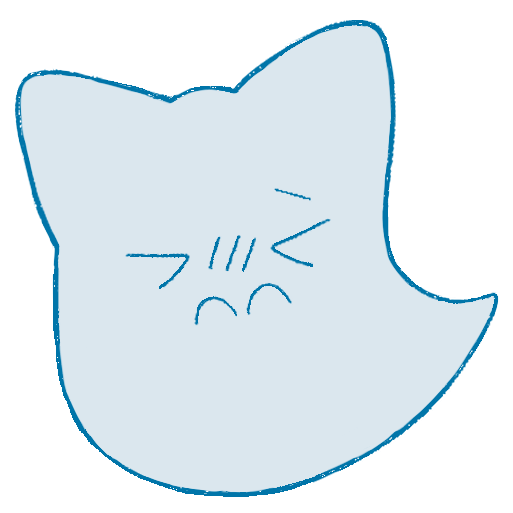

<h1 align='center'>Hi^>ω<^ I'm Nullcat chan!</h1>

### About me
<ul>
  <li type='square'>I'm a high school student in Japan🏫
  <li type='square'>I've only been learning programming for a short time😓
  <li type='square'>I've worked on several web design projects🎨
  <li type='square'>Please feel free to talk to me🥰
</ul>

### Links

### My Environment

  
  
  
  
  
### What I know

  
  
  
  

### What I'm learning

  
  
  
  

### Stats

  </a>
  

  
